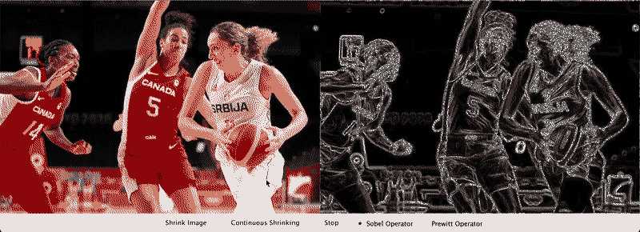
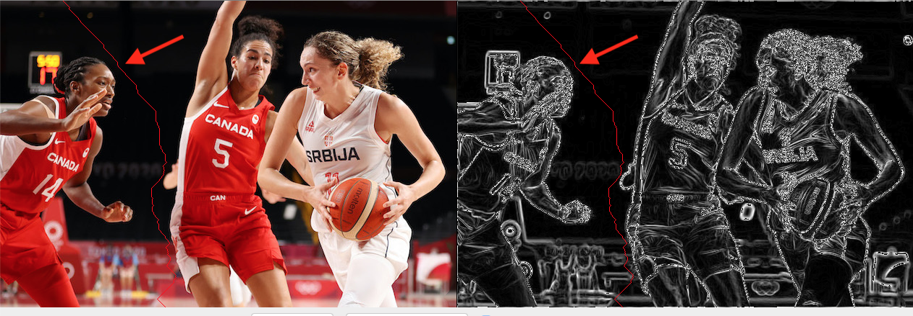
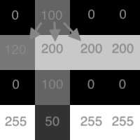
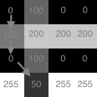

# Assignment Image Shrinking

In this assignment you will build the backend for an image shrinking application.



You will complete the `EdgeAvoidanceImageShrinking` class that is a provided to you. It will compliment the GUI front end that is provided in the IntelliJ project along with the provided unit-tests.

*You are once again encouraged to use any AI tools you like to aid in this work. Just add a comment to any code that is AI generated to indicate so:*

```java
/** The following methods were developed using Github Copilot:

 - methodOne()
 - methodTwo()
 - methodThree()
 **/
```

You can work on this assignment in pairs or individually

The image shrinking application will attempt to be `smart`. It will remove a path of pixels leading from the top of the image to the bottom from an un-interesting area of the image. Here we define un-interesting as those pixels in the image that are similar to their local neighbours (by contrast interesting areas of an image will contain pixels that are different from their local neighbours). Recall from calculus that you can measure rate of change using derivatives. We will have to estimate similarity of pixels by estimating the derivative of the image (aka the gradient), i.e., we estimate how quickly the intensity (brightness) of the pixels is changing. The magnitude of the gradient gives a general estimate of how interesting the region around a pixel is.

We can estimate the similarity of local pixels by estimating the magnitude of the gradient of the image. For example two black pixels beside one another would have a low gradient (they are similar) but a black pixel next to a white pixel would have a high gradient (they are not similar = high rate of change as we move from one pixel to the other).

In this assignment we will use two different gradient operators:

  - **sobel** operator, and
  - **prewitt** operator.

## Gradients

You are given code for the sobel operator and you are asked as part of your first deliverable to add code for the prewitt operator. The operators are very similar to one another and so completing the first deliverable should not involve too much work. Don't be alarmed ... the gradients here are just *cool* image processing techniques that are fun to introduce in this assignment.

Each of the Sobel and Prewitt operators have a vertical and horizontal component. In the below equations the `*` operation is image convolution (basically a dot product that occurs centred at each pixel in the original image), while `A` is the original image.

Sobel:

$$G_x = \begin{bmatrix}
+1 & 0 & -1 \\
+2 & 0 & -2\\
+1 & 0 & -1
\end{bmatrix} * A $$

$$G_y = \begin{bmatrix}
+1 & +2 & +1 \\
0 & 0 & 0\\
-1 & -2 & -1
\end{bmatrix} * A $$

Prewitt:

$$G_x = \begin{bmatrix}
+1 & 0 & -1 \\
+1 & 0 & -1\\
+1 & 0 & -1
\end{bmatrix} * A$$

$$G_y = \begin{bmatrix}
+1 & +1 & +1 \\
0 & 0 & 0\\
-1 & -1 & -1
\end{bmatrix} * A $$

In either case the magnitude of the gradient (at each pixel) is computed as:

$$G= \sqrt{{G_x}^2 + {G_y}^2}$$

You are given the code to perform the convolution. As you'll see below you are tasked with completing the Prewitt operator code for Deliverable 1, but that amounts to only a couple of small integer changes from the Sobel code that is provided in your starter code package.

In our assignment we will wrap the gradient operators around the edges of the image (low energy paths will not wrap) - in other words if you are in the first row of the image, then the northern neighbour pixels are found by wrapping around to the bottom row .. and similar for the left, right and bottom of the image.


(original image (left): Gregory Shamus via Getty Images), gradient (or energy) image of the original (right)

In the above image you see an original image on the left and the gradient magnitude image on the right (in this case it is the sobel operator applied to the pixels in the original image). Each of the Sobel and Prewitt operators are also considered as edge detectors (the edges of objects in pictures are often where an image is changing the fastest and so they produce the largest gradient values).

For example, in the images shown above, the player's arm as compared against the background are drastically different brightness levels and therefore we might have one pixel that is the color of the player and the very next pixel is the background (a very fast change). This change will produce a large gradient value when we apply our gradient operator (which shows as white in the gradient image on the right) - white pixels indicate large gradient values and black indicates small gradient values (while gray levels are in between).

## Low Energy Path



In the above image you see a faint red line, this red line represents the pixels that will be removed from the image to shrink it by 1 unit (after removing the red line the image is 1 pixel narrower). **The red line is found by computing the path that leads from the top of the image to the bottom, such that the sums of the pixels we pass through are a minumum, i.e., if we consider gradient values of a pixel as the weight of an edge in a graph, we are trying to find the shortest path from top to bottom of the image.**

Consider that the pixels of the image are vertices and there are edges between every pixel and its 3 closest southern neighbours are given by the values of those southern neighbours, i.e., it costs that much to travel to a particular pixel. This can be thought of as a graph, and since the edges are directed and only move `down` the image, there are no cycles, it is a **Directed Acyclic Graph (DAG)**.

While in the above on the right is a color image with pixels made up of RGB values, your backend code will be given a gray version of this image, where the pixels are integers representing the brightness (or luminance) of the pixel.  See below the version of the original image your code will operate on (the luminance image):


See below a small example 4x4 gradient image (the sobel or prewitt operator has already been applied).



In images we will refer to the column first and then the row (with each starting from 0), so in the above we have the 1st column and 0th row (1,0) a pixel with energy (or gradient) value 100. It has 3 southern neighbours below left, directly below and below right with image positions:  (0,1), (1,1) and (2,1) respectively. Thus if we wanted to consider the lowest energy path from the top of the image to the bottom we may consider paths starting from (1,0) and then we may consider any of the 3 next southerly positions. The lowest energy path leaving from (1,0) will go through one of those 3 southerly neighbours.

# Details on the shortest path

The shortest path is found by considering all possible starting positions (each column in row 0) and computing the shortest path leaving from each of those positions (in the energy / gradient image). Remember we have a directed acyclic graph (our paths only flow down, there are no cycles) that means we can leverage this natural topological ordering to help efficiently compute the shortest paths.

We update the shortest paths as we \`flow down\` the image the bottom row will determine the ending point of our shortest path. By walking back up the `edgeTo` array we can recreate the actual path of pixels in the shortest path.



Note: Shortest paths cannot wrap from the edge of the image back to the other edge. This would create image distortion (someone's head could shift right and their body shift left for example if we allowed wrapping of the path).

# Deliverables

# Deliverable 1

Your task it to implement the Prewitt operator. To do this you must complete the `public int prewitt(int x, int y)` as part of the `EdgeAvoidanceImageShrinking` class

You don't need to overthink this. Essentially the goal of this deliverable is to gain comfort with the end goal and how to navigate and operate on an image.

You are given code for the Sobel operator and the calculations expected in the Prewitt are almost identical, the matrices just differ by a few values.

## Grading Deliverable 1

Deliverable 1 is graded out of 2 points as follows

Pass all tests in the `GradientOperatorTests` class. This can be found in the `test` folder of the project.

Your deliverable 1 grade is 2 if you pass all of the tests and zero otherwise.

# Final Deliverables

Complete the assignment, by completing the low energy path. Part of the grading will be manual inspection although a couple of unit-tests are provided they do not offer full coverage.

## Grading

Functional Aspects of Deliverable 1: X/2
Readability: X/2
Code Design: X/2
Functionality: X/4

Readability notes - proper names, self-documenting code, all methods and classes are documented

Design notes - the algorithm is easily identified, proper use of methods and classes, no excessively long methods

Functionality - all unit-tests passing, manual inspection shows a working program

There is a lot of code provided to you in this assignment, so there are only a couple of methods required for you to complete the assignment. You could separate out the algorithm by create a new class to implement some algorithm.

Note that there are various methods to solve this problem, you are encouraged to stick to the topological based graph algorithm from our class notes. See below.

# Due Date:

All deliverables are due on the last day of classes for the winter semester.

Grades for this assignment will be converted to out of 5 and applied as bonus points.

# Tips and Hints

While we can use our code from Algorithms 4th Edition to help in this case we'd have to convert the pixels in the image into vertices and add all the edges (being the pixel values after applying the sobel or prewitt operator) ... that is a fair bit of extra processing. The image inherently has an ordering to it and we can therefore view it as a natural sort of graph. Therefore we do not need to create a Graph with Vertices and Edges but rather modify the approach from our textbook to `walk` down the image following the natural edges and updating the matching distTo and edgeTo arrays (or 2D arrays if we make them match the image exactly).
